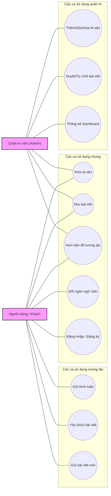
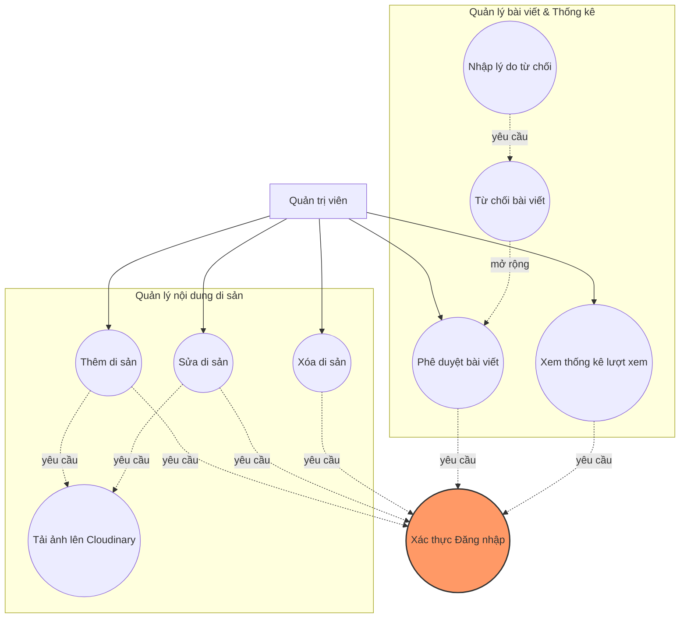
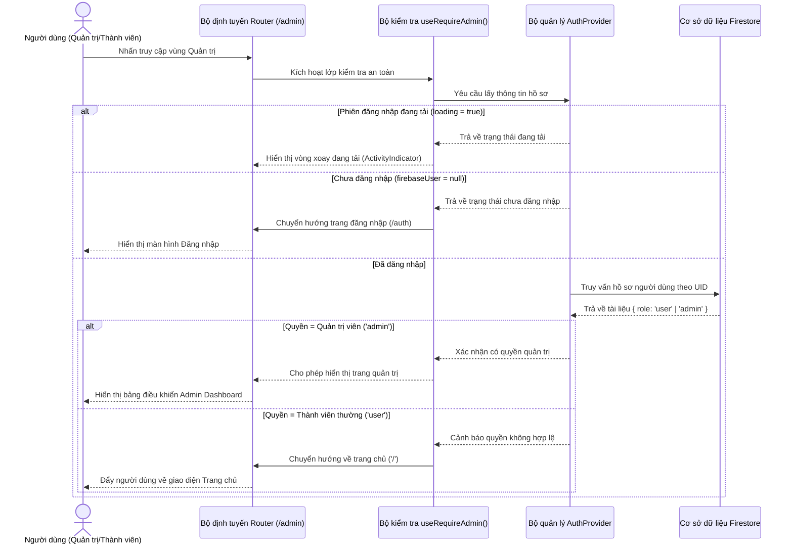
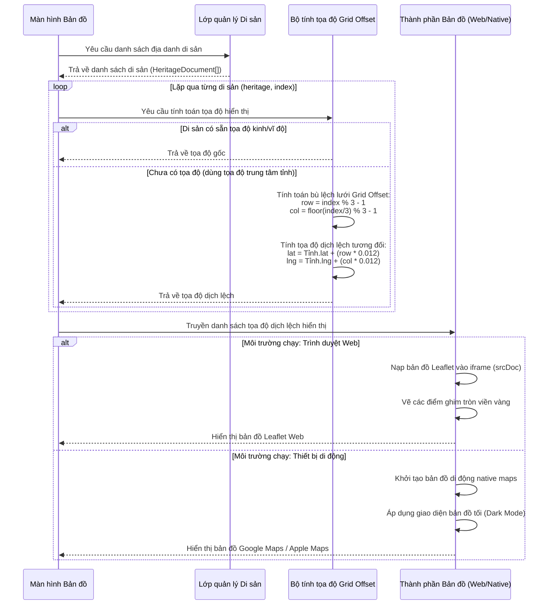
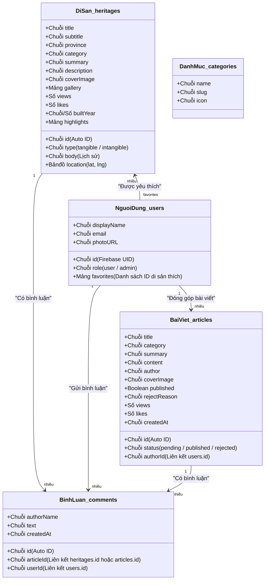
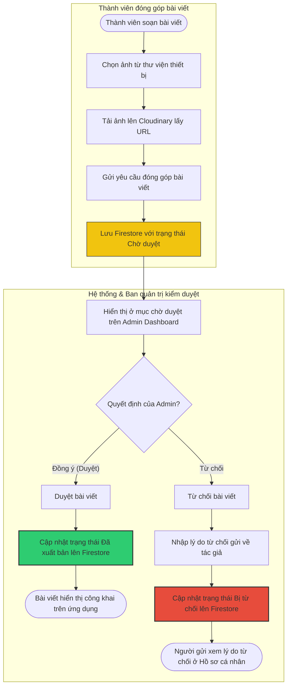
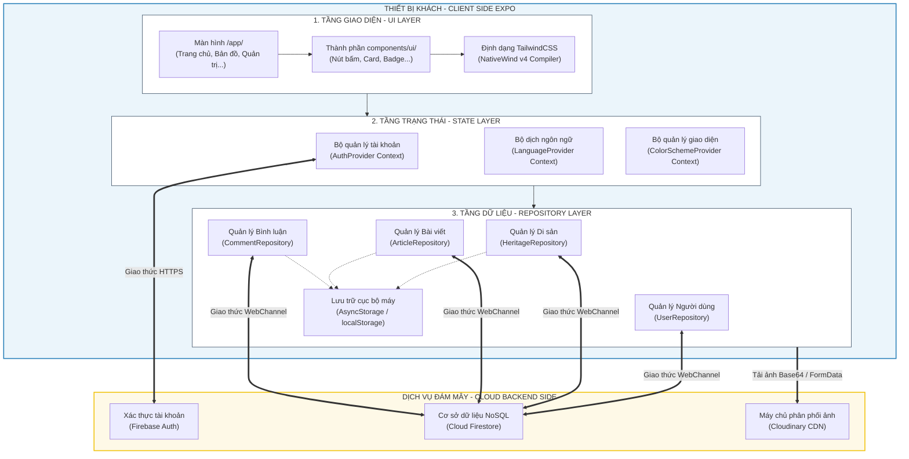

```mermaid
graph TD
    App["Thư mục app/ (Bộ định tuyến gốc)"] --> Layout["Tệp _layout.tsx (Cấu hình hệ thống & Khởi tạo Context)"]
    App --> Auth["Tệp auth.tsx (Đăng nhập / Đăng ký)"]
    
    App --> Tabs["Thư mục (tabs)/ (Thanh điều hướng dưới cùng)"]
    Tabs --> TLayout["Tệp _layout.tsx (Cấu hình 5 màn hình chính)"]
    Tabs --> THome["Tệp index.tsx (Trang chủ chính)"]
    Tabs --> THeritage["Tệp heritage.tsx (Danh sách di sản & Bộ lọc)"]
    Tabs --> TExplore["Tệp explore.tsx (Khám phá bài viết văn hóa)"]
    Tabs --> TMap["Tệp map.tsx (Bản đồ tương tác di sản)"]
    Tabs --> TProfile["Tệp profile.tsx (Hồ sơ người dùng)"]

    App --> DetailHeritage["Thư mục heritage/[id].tsx (Xem chi tiết Di sản)"]
    App --> DetailArticle["Thư mục articles/[id].tsx (Xem chi tiết Bài viết)"]
    App --> NewArticle["Tệp articles/new.tsx (Gửi bài đóng góp mới)"]

    App --> Admin["Thư mục admin/ (Phân vùng dành cho Admin)"]
    Admin --> ALayout["Tệp _layout.tsx (Kiểm soát quyền truy cập Admin)"]
    Admin --> AIndex["Tệp index.tsx (Bảng điều khiển & Phê duyệt bài)"]
    Admin --> AHeritage["Tệp heritages.tsx (Thêm/Sửa/Xóa di sản)"]
    Admin --> AArticle["Tệp articles.tsx (Xem/Sửa/Xóa bài viết)"]

    App --> ProfileSub["Thư mục profile/ (Các trang thiết lập cá nhân)"]
    ProfileSub --> PSetting["Tệp settings.tsx (Cài đặt hiển thị & giao diện)"]
    ProfileSub --> PFavorite["Tệp favorites.tsx (Danh sách đã yêu thích)"]
    ProfileSub --> PHistory["Tệp history.tsx (Lịch sử địa điểm đã xem)"]

    style Tabs fill:#d4af37,stroke:#333,stroke-width:2px;
    style Admin fill:#e74c3c,stroke:#333,stroke-width:2px;
```

# TÀI LIỆU MÔ TẢ VÀ THIẾT KẾ CÁC SƠ ĐỒ NGHIỆP VỤ: KHMER HERITAGE APP (BẢN TIẾNG VIỆT)

Tài liệu này mô tả chi tiết cấu trúc, mục đích, thành phần tham gia và luồng nghiệp vụ của toàn bộ các sơ đồ phân tích thiết kế hệ thống cho ứng dụng **Khmer Heritage App** bằng ngôn ngữ Tiếng Việt trực quan, dễ hiểu.

Các sơ đồ dưới đây hoàn toàn phù hợp và đủ tiêu chuẩn học thuật cho báo cáo khóa luận/đồ án của bạn. Bên cạnh 7 sơ đồ bạn đã đề xuất, tài liệu này bổ sung thêm **1 sơ đồ hoạt động (Activity Diagram) của Luồng gửi và duyệt bài viết** (đây là tính năng cốt lõi thể hiện tính hai chiều tương tác giữa người dùng và admin trong hệ thống của bạn).

Mỗi sơ đồ đi kèm với **mã nguồn Mermaid.js bản tiếng Việt**. Bạn chỉ cần sao chép mã nguồn Mermaid này và dán vào [Mermaid Live Editor (https://mermaid.live)](https://mermaid.live) hoặc các phần mềm hỗ trợ Markdown (như VS Code, GitHub) để xuất ra file ảnh chất lượng cao (PNG, SVG, PDF) chèn vào tài liệu Word của báo cáo.

---

## MỤC LỤC
1. [Sơ đồ Use Case tổng quát hệ thống phân quyền (3.1.1)](#1-sơ-đồ-use-case-tổng-quát-hệ-thống-phân-quyền-311)
2. [Sơ đồ Use Case chi tiết phân hệ Quản trị viên (3.1.2)](#2-sơ-đồ-use-case-chi-tiết-phân-hệ-quản-trị-viên-312)
3. [Sơ đồ quy trình nghiệp vụ dịch thuật đa ngôn ngữ i18n (3.1.3)](#3-sơ-đồ-quy-trình-nghiệp-vụ-dịch-thuật-đa-ngôn-ngữ-i18n-313)
4. [Sơ đồ tuần tự xử lý luồng bảo mật trang quản trị (3.2.1)](#4-sơ-đồ-tuần-tự-xử-lý-luồng-bảo-mật-trang-quản-trị-321)
5. [Sơ đồ tuần tự kết xuất bản đồ và dịch chuyển tọa độ Grid Offset (3.2.2)](#5-sơ-đồ-tuần-tự-kết-xuất-bản-đồ-và-dịch-chuyển-tọa-độ-grid-offset-322)
6. [Sơ đồ ánh xạ liên kết cơ sở dữ liệu NoSQL Firestore Schema (3.3.1)](#6-sơ-đồ-ánh-xạ-liên-kết-cơ-sở-dữ-liệu-nosql-firestore-schema-331)
7. [Sơ đồ cấu trúc cây điều hướng tệp tin File-Based Routing (3.3.2)](#7-sơ-đồ-cấu-trúc-cây-điều-hướng-tệp-tin-file-based-routing-332)
8. [Sơ đồ hoạt động (Activity) Luồng gửi và duyệt bài viết mới (Bổ sung thêm)](#8-sơ-đồ-hoạt-động-activity-luồng-gửi-và-duyệt-bài-viết-mới-bổ-sung-thêm)
9. [Sơ đồ kiến trúc tổng thể hệ thống (Bổ sung thêm)](#9-sơ-đồ-kiến-trúc-tổng-thể-hệ-thống-bổ-sung-thêm)

---

## 1. Sơ đồ Use Case tổng quát hệ thống phân quyền (3.1.1)

*   **Mục đích:** Khái quát hóa ranh giới tương tác hệ thống giữa hai nhóm tác nhân chính: Người dùng thường (Khách vãng lai, người dùng đã đăng nhập) và Quản trị viên cấp cao (Admin).
*   **Tác nhân (Actors):**
    *   **NguoiDung (Người dùng/Khách):** Học sinh, sinh viên, khách du lịch, người muốn tìm hiểu văn hóa.
    *   **QuanTriVien (Quản trị viên):** Ban quản lý nội dung di sản, biên tập viên văn hóa.
*   **Ca sử dụng chính (Use Cases):**
    *   Xem & Tìm kiếm di sản văn hóa.
    *   Xem bài viết nghiên cứu văn hóa.
    *   Xem bản đồ định vị địa lý.
    *   Bình luận đóng góp ý kiến (yêu cầu đăng nhập).
    *   Yêu thích bài viết/di sản (yêu cầu đăng nhập).
    *   Chuyển đổi ngôn ngữ giao diện (Việt, Khmer, Anh).
    *   Đăng ký / Đăng nhập tài khoản.
    *   Quản lý thông tin di sản (Chỉ Admin).
    *   Kiểm duyệt bài đóng góp của thành viên (Chỉ Admin).
    *   Theo dõi thống kê hệ thống (Chỉ Admin).

### Mã nguồn Mermaid:


---

## 2. Sơ đồ Use Case chi tiết phân hệ Quản trị viên (3.1.2)

*   **Mục đích:** Đặc tả các chức năng quản lý nội dung của Admin cùng mối quan hệ phụ thuộc (`<<include>>`), mở rộng (`<<extend>>`).
*   **Chi tiết nghiệp vụ:**
    *   Để thực hiện các tác vụ tạo mới di sản, phê duyệt bài viết, hoặc xem thống kê lượt xem, hệ thống yêu cầu Admin bắt buộc phải đi qua tiến trình Xác thực đăng nhập (`<<include>>`).
    *   Khi phê duyệt bài viết, Admin có thể lựa chọn từ chối kèm theo việc nhập lý do từ chối cụ thể (`<<extend>>`).

### Mã nguồn Mermaid:


---

## 3. Sơ đồ quy trình nghiệp vụ dịch thuật đa ngôn ngữ i18n (3.1.3)

*   **Mục đích:** Trực quan hóa tiến trình lưu trữ và dịch thuật tự động (i18n) ngay khi ứng dụng khởi chạy và khi người dùng thực hiện chuyển đổi ngôn ngữ.
*   **Các bước xử lý:**
    1.  Đọc bộ nhớ cục bộ để kiểm tra khóa `@khmer_heritage_language`.
    2.  Gán ngôn ngữ ưa thích cũ hoặc mặc định là Tiếng Việt (`vi`).
    3.  Tải từ điển tương ứng và render ra UI.
    4.  Khi người dùng đổi ngôn ngữ, cập nhật trạng thái runtime và ghi đè xuống bộ nhớ thiết bị.

### Mã nguồn Mermaid:
```mermaid
flowchart TD
    BatDau([Khởi chạy ứng dụng]) --> DocBoNho[Đọc bộ nhớ cục bộ STORAGE_KEY]
    DocBoNho --> KiemTraNgonNgu{Có ngôn ngữ lưu cũ?}
    
    KiemTraNgonNgu -- Có --> GanNgonNguCu[Gán language = savedLang]
    KiemTraNgonNgu -- Không --> GanMacDinh[Gán language = 'vi']
    
    GanNgonNguCu --> NapTuDien[Tải từ điển translations[language]]
    GanMacDinh --> NapTuDien
    
    NapTuDien --> HienThiGiaoDien[Kết xuất giao diện qua hàm t]
    
    HienThiGiaoDien --> ChoNguoiDung{Người dùng đổi ngôn ngữ?}
    
    ChoNguoiDung -- Chọn ngôn ngữ mới --> LuuBoNho[Ghi đè ngôn ngữ mới xuống bộ nhớ máy]
    LuuBoNho --> CapNhatRuntime[Cập nhật trạng thái language runtime]
    CapNhatRuntime --> NapTuDien
    
    ChoNguoiDung -- Không đổi --> KetThuc([Duy trì ứng dụng])
```

---

## 4. Sơ đồ tuần tự xử lý luồng bảo mật trang quản trị (3.2.1)

*   **Mục đích:** Minh chứng kiến trúc bảo vệ an ninh định tuyến Client-side thông qua hook `useRequireAdmin()` kết hợp dữ liệu lưu trữ từ Firestore.
*   **Các thành phần (Participants):**
    *   **Người dùng:** Người thực hiện thao tác nhấp vào mục quản trị.
    *   **Bộ định tuyến Router:** Trình định hướng Expo Router.
    *   **Bộ kiểm tra `useRequireAdmin()`:** Bộ lọc bảo vệ luồng route.
    *   **Bộ quản lý AuthProvider:** Nơi quản lý phiên làm việc hiện tại của tài khoản.
    *   **Cơ sở dữ liệu Firestore:** Nơi lưu giữ thuộc tính vai trò `role` bảo mật.

### Mã nguồn Mermaid:


---

## 5. Sơ đồ tuần tự kết xuất bản đồ và dịch chuyển tọa độ Grid Offset (3.2.2)

*   **Mục đích:** Mô tả chi tiết quy trình hiển thị bản đồ tương tác và cách thức vận hành của giải thuật bù đắp dịch chuyển tọa độ `getHeritageCoordinates()` tránh đè lấp Marker.
*   **Các thành phần (Participants):**
    *   **Màn hình Bản đồ:** Màn hình bản đồ giao diện chính.
    *   **Lớp dữ liệu Di sản:** Tầng truy xuất dữ liệu di sản (HeritageRepository).
    *   **Bộ tính tọa độ Grid Offset:** File thuật toán tính toán tọa độ dịch lệch (CoordinatesHelper).
    *   **Thành phần Bản đồ:** Thành phần kết xuất bản đồ (Leaflet trên Web hoặc Google Maps trên Native).

### Mã nguồn Mermaid:


---

## 6. Sơ đồ ánh xạ liên kết cơ sở dữ liệu NoSQL Firestore Schema (3.3.1)

*   **Mục đích:** Trực quan hóa cấu trúc sơ đồ dữ liệu phi quan hệ (NoSQL) hướng tài liệu của dự án. Thay thế sơ đồ thực thể liên kết ERD truyền thống của SQL.
*   **Chú ý:** Các tên thực thể lớp và trường dữ liệu bắt buộc phải giữ nguyên như trong code để phục vụ việc kiểm duyệt mã nguồn, tuy nhiên các kiểu dữ liệu và mối quan hệ liên kết đã được mô tả chi tiết bằng Tiếng Việt.

### Mã nguồn Mermaid:


---

## 7. Sơ đồ cấu trúc cây điều hướng tệp tin File-Based Routing (3.3.2)

*   **Mục đích:** Mô tả cơ chế tổ chức định tuyến (Routing) tự động của Expo Router thông qua sơ đồ cây phân nhánh các thư mục tệp tin trong thư mục `/app`.

### Mã nguồn Mermaid:


---

## 8. Sơ đồ hoạt động (Activity) Luồng gửi và duyệt bài viết mới (Bổ dung thêm)

*   **Mục đích:** Bổ sung nghiệp vụ cốt lõi chứng minh tính tương tác 2 chiều và quy trình vận hành kiểm duyệt bài đóng góp của thành viên gửi lên ứng dụng.

### Mã nguồn Mermaid:


---

## 9. Sơ đồ kiến trúc tổng thể hệ thống (Bổ sung thêm)

*   **Mục đích:** Khái quát hóa toàn bộ kiến trúc đa tầng (Multilayered Architecture) của hệ thống phần mềm, phân định ranh giới rõ rệt giữa mã nguồn ứng dụng chạy tại thiết bị khách (Client-side) và các tài nguyên, dịch vụ điện toán đám mây vận hành ở phía máy chủ (Cloud Backend-side).
*   **Các tầng kiến trúc cốt lõi (Client-side):**
    *   **Tầng giao diện (UI Layer):** Xây dựng bằng React Native kết hợp biên dịch NativeWind (TailwindCSS) sang StyleSheet gốc giúp tối ưu hóa phần cứng hiển thị.
    *   **Tầng quản lý trạng thái (State Layer):** Các bộ Context API runtime (Ngôn ngữ, Giao diện tối/sáng, Trạng thái tài khoản người dùng) hoạt động như một lớp phản chiếu dữ liệu toàn cục.
    *   **Tầng trừu tượng dữ liệu (Repository Pattern / DAL):** Lớp giao tiếp trung gian cách ly UI khỏi các truy vấn thô, tích hợp bộ lưu trữ đệm cục bộ (`AsyncStorage`/`localStorage`) để hỗ trợ chạy offline.
*   **Kiến trúc Backend & Dịch vụ Đám mây (Cloud Services):**
    *   **Firebase Authentication:** Quản lý tài khoản, mã hóa bảo mật phiên đăng nhập.
    *   **Cloud Firestore:** Lưu trữ cơ sở dữ liệu NoSQL phân tán dưới dạng tài liệu (Documents).
    *   **Cloudinary Image Server:** Lưu trữ hình ảnh và tự động nén, thay đổi kích thước bằng CDN.

### Sơ đồ kiến trúc Mermaid:


